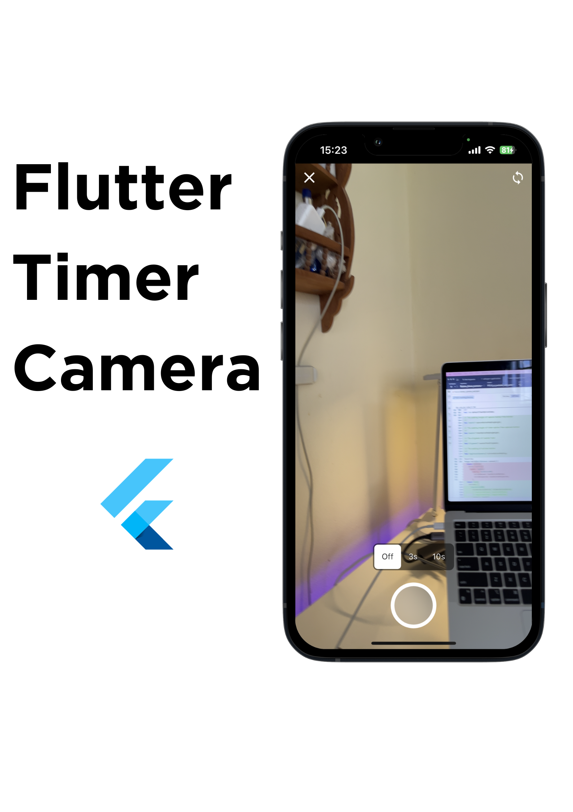

<p align="left">
  <span> </span>
  
</p>

# Flutter Timer Camera

A Flutter package that allows you to open the camera and capture image with a timer logic.

 

|| Android      | iOS |
|----| ----------- | ----------- |
| **Support** | SDK 21+      | iOS 11.0 +       |


*we support only these versions since this package adopts the `camera` plugin*

## Features
- Open the customized camera directly from Flutter app.
- Set a timer to delay the capture.
- Switch camera front and back.

## Installation

To use this package, add `flutter_timer_camera` as a [dependency in your pubspec.yaml file](https://docs.flutter.dev/packages-and-plugins/using-packages).


```ymal
dependencies:
  flutter_timer_camera: ^1.0.3
```

**iOS**

Add camera usage description on `ios/Runner/Info.plist`.

```plist
<key>NSCameraUsageDescription</key>
<string>describe why you use camera access</string>
```

**Android**

Change minimumSdk version to at least 21

```
minSdkVersion 21
```

## Usage

```dart
import 'package:flutter_timer_camera/flutter_timer_camera.dart';

.
.
.

ElevatedButton(
  onPressed: () {
    showTimerCamera(
      context: context,
      onSubmit: (Xfile? capturedImage) {
        setState(() {
          currentImage = capturedImage;
        });
      },
    );
  },
  child: const Text('Open Camera'),
),
```

### Parameters for `showTimerCamera`

| Parameter | Description |
|---|---|
|BuildContext context| The BuildContext in which the bottom sheet is shown. |
|OnCapturedImageCallback onSubmit| Callback function that's triggered when an image is captured. |
|bool enableDrag = false| Specifies if the bottom sheet can be dragged. Defaults to false. |
|VoidCallback? onCameraAccessDenied| Callback for handling unauthorized camera access. |
|BoxFit? imageFit| Defines how the captured image should fit within the bounds of the camera view. |
|Widget? backButtonOnNormal| Custom widget for the back button in its normal state. |
|Widget? backButtonOnCaptured| Custom widget for the back button in the captured image state. |
|Widget? switchCameraButton| Custom widget for the switch camera button. |
|ButtonStyle? switchCameraButtonStyle| Style for the switch camera button. |
|Alignment? captureButtonAlignment| Alignment for the capture button. |
|Widget? onNormalButton| Custom widget for the capture button in its normal state. |
|Widget? onCountingButton| Custom widget for the capture button during countdown. |
|Widget? onCapturedButton| Custom widget for the capture button in the captured state. |
|Alignment? timerOptionAlignment| Alignment for timer options. |
|TimerOptionStyleParamsModel? timerOptionStyleParamsModel| Styling parameters for timer options. |
|TextStyle? counterTextStyle| Text style for the countdown timer. |
|List<TimerOption>? timerOptions| List of timer options for capturing images. |
|double? captureButtonPaddingHeight| Padding height for the capture button from the bottom. |
|double? timerOptionPaddingHeight| Padding height for the timer options from the captured button. |
|Alignment? counterTextAlignment| Alignment for the countdown timer text. |
|EdgeInsetsGeometry? actionButtonPadding| Padding for action buttons. |
|int defaultTimerOptionIndex = 0| Default selected index for timer options. |
|bool useSafeArea = true| Determines whether to respect safe area insets. Defaults to true. |
|bool isDismissble = true| Indicates whether the sheet is dismissible. Defaults to true. |
|bool useRootNavigator = false| Ensures that the root navigator is used for navigation when true. |


## Contributing

Any kind of pull requests are welcome. Feel free to fork the project, open issues, and submit PRs.

## License

[The 3-Clause BSD](https://opensource.org/license/bsd-3-clause/)